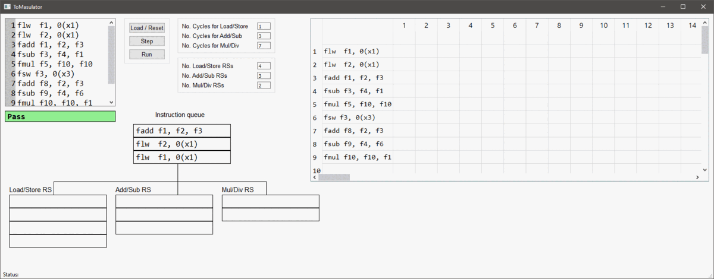

# ToMasulator: A Tomasulo & Scoreboarding Visual Simulator
A simple visual simulator developed fully in Python and based on the Tomasulo and 
Scorebaording algorithms as described in the book 
[Computer Architecture: A Quantitative Approach](https://www.amazon.com/gp/product/0128119055/ref=dbs_a_def_rwt_bibl_vppi_i1),
and further explained here: [Tomasulo algorithm](https://en.wikipedia.org/wiki/Tomasulo_algorithm), and here: 
[Scoreboarding](https://en.wikipedia.org/wiki/Scoreboarding).

It only supports 6 instructions, but this is enough to showcase the scheduling of instructions in both algorithms.

# How to run
Prebuilt binaries are available for Windows via the [Releases](https://github.com/masoud-ata/ToMasulator/releases/) page.

To run directly from the source code, if you have all the required packages (that is **PyQt5**), 
just use the following in your command line, or run the file **main.py** in your IDE of choice:

**python main.py**

The simulator has been tested on Windows 10, Linux and Mac with Python 3.6

# Simulator's main window
Below is an animated image of the simulator's window showing the editor, the instruction queue, 
different reservation stations, and the instruction timing table. 
The number of latency cycles of different units is adjustable. 
There is also the possibilty of changing the number of resevation stations. 
As mentioned above, the scheduling algorithm can be changed by a dropdown menu. 

There are 3 buttons allwoing to load the assembly program (or reset the system), step through the code, and execute the code fully, respectively.

